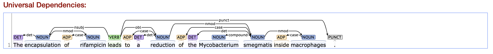
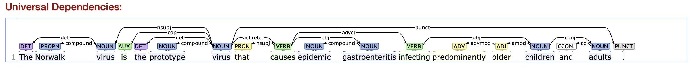
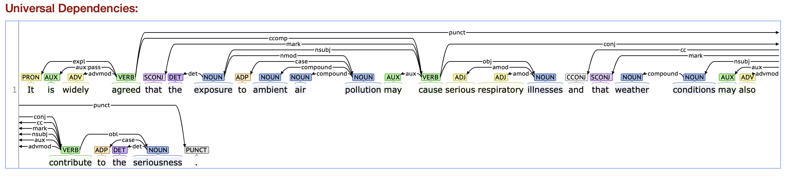
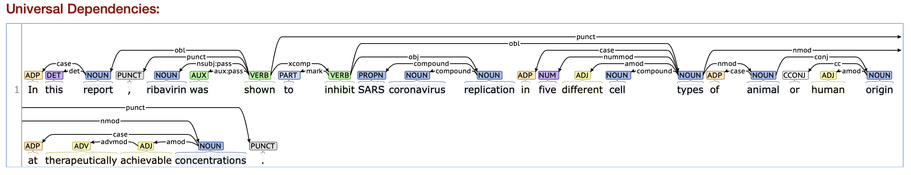
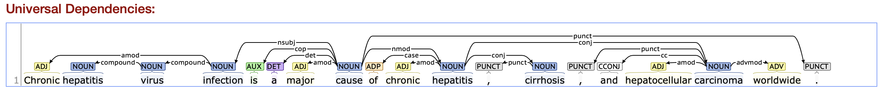

# SPO extractor

## Example sentences and universal dependencies


* The encapsulation of rifampicin leads to a reduction of the Mycobacterium smegmatis inside macrophages.
* nsubj (nominal subject) <= VERB => obl (oblique nominal)


* The Norwalk virus is the prototype virus that causes epidemic gastroenteritis infecting predominantly older children and adults.
* acl:relcl (adjectival clause) => VERB => obj (object)


* It is widely agreed that the exposure to ambient air pollution may cause serious respiratory illnesses and that weather conditions may also contribute to the seriousness.
* nsubj <= VERB => obj


* In this report, ribavirin was shown to inhibit SARS coronavirus replication in five different cell types of animal or human origin at therapeutically achievable concentrations.
* nsubj:pass <= xcomp => VERB => obj


* Chronic hepatitis virus infection is a major cause of chronic hepatitis, cirrhosis, and hepatocellular carcinoma worldwide.
* nsubj <= NOUN => nmod => conj
* coordinating conjunctions

## What is Stanza?
* Stanza is a python wrapper for Stanford CoreNLP and PyTorch NLP models.
* tregex for chunking
* neural pipelien for dependency parsing

## Algorithm
1. Given a sentence and a list of triggers,
2. Check if a trigger is fired.
3. If a trigger is fired, run a dependency parser and a chunker on the sentence.
4. Using the dependency relations of the trigger, identify head words.
5. Extract noun phrases by merging dependency relations and chunks based on the head words. 

## Usages

* Download [Stanford CoreNLP](http://nlp.stanford.edu/software/stanford-corenlp-latest.zip) and [an English models](http://nlp.stanford.edu/software/stanford-corenlp-4.0.0-models-english.jar) for the language you wish to use
* Put the model jars in the distribution folder

* Setting up environment variables
```bash
export CORENLP_HOME=/path/to/stanford-corenlp-full-2020-04-20
export DATA_DIR=/path/to/data/
```

* How to install dependencies?
```bash
pip install -r requirements.txt
```

* Download a model for a neural dependency parser
```bash
python -c 'import stanza; stanza.download("en")'
```

* How to run tests?
```bash
cd /path/to/project-directory
PYTHONPATH=. pytest tests/test_SPOs.py

export DATA_DIR="$(pwd)/data/tests"
PYTHONPATH=. pytest tests/test_data_reader.py
```

* How to get SPOs for example sentences
```bash
PYTHONPATH=. python tests/test_SPOs.py
```

* How to extract SPO?
```bash
PYTHONPATH=. python bin/run_spo.py -i input_directory -o output_file
```

## What is missing?

* Biomedical Named Entity Recognisers can be used to improve NP chunking and to identify the roles on NPs.
